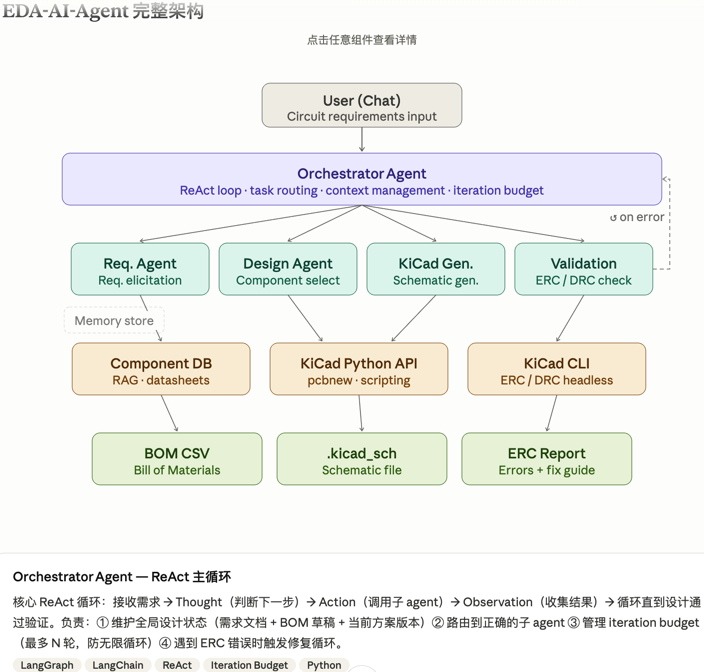

<div align="center">

# EDA-AI-Agent

[](https://www.python.org/)
[](https://fastapi.tiangolo.com/)
[](https://nodejs.org/)
[](https://react.dev/)
[](https://www.typescriptlang.org/)
[](https://www.litellm.ai/)
[](https://www.kicad.org/)

[English](README_en.md) · 简体中文

---

> 用自然语言描述电路需求，AI 通过国伦对话分析需求细节，自动完成元器件选型、生成.kicad_sch 格式的电路图描述文本文件，然后应用 kicad-cli 对电路图进行验证，
最终的电路图直接在浏览器中预览，也可以在 KiCad 软件中打开。
> 关于最流行的开源 EDA（Electronic Design Automation） 软件 KiCar，请参阅 https://www.kicad.org/ 。

</div>

## 可行性评估

先给结论：**可行，但有边界**。

| 维度             | 判断      | 说明                                     |
| -------------- | ------- | -------------------------------------- |
| 需求拆解对话         | ✅ 完全可行  | LLM 最擅长的事                              |
| 方案选型建议         | ✅ 可行    | LLM 有足够的电路知识储备                         |
| 生成 KiCad 原理图文件 | ✅ 可行    | KiCad `.kicad_sch` 是纯文本格式，可程序化生成       |
| 自动 PCB 布局布线    | ⚠️ 部分可行 | KiCad 有 Python API，但自动布局质量有限，复杂板需要人工介入 |
| 电路正确性验证        | ✅ 可行    | KiCad CLI 可运行 ERC / DRC，结果反馈给 agent    |
| 完全商业级免人工       | ❌ 当前不现实 | 复杂模拟电路、高速信号、EMC 设计仍需工程师审查              |

核心突破口是 KiCad 的文件格式。.kicad_sch 是 S-expression 纯文本，结构高度规则，LLM 可以直接学习并生成。这是整个 agent 可行的技术基础。
KiCad 7/8 的 `.kicad_sch` 格式是结构化的 S-expression 文本，LLM 可以直接生成和修改；KiCad 内置 Python 脚本 API (`pcbnew`) 可以程序化操作 PCB；KiCad CLI 支持无头模式运行 ERC/DRC 并输出报告。

---

## 工作原理

```
用户描述需求
    ↓
需求分析 Agent   → 与用户多轮确认，输出结构化需求
    ↓
电路设计 Agent   → 从本地 KiCad 元件库选型，输出 BOM
    ↓
原理图生成 Agent → 生成 .kicad_sch 格式的 文本文件
    ↓
ERC 验证 Agent   → 调用 KiCad CLI 检查，最多自动修复 3 次
    ↓
浏览器预览 + 下载
```

每个 Agent 调用你自己配置的大模型 API，支持 OpenAI、Anthropic、DeepSeek、Qwen 等所有主流厂商。

---

## 架构图


---

## 环境要求

### macOS

```bash
# Python 3.12
brew install python@3.12

# Node.js 22 LTS
brew install node@22

# KiCad（可选，用于 ERC 检查）
brew install --cask kicad
```

### Linux（Ubuntu / Debian）

```bash
# Python 3.12
sudo apt update
sudo apt install python3.12 python3.12-venv python3.12-pip

# Node.js 22 LTS
curl -fsSL https://deb.nodesource.com/setup_22.x | sudo -E bash -
sudo apt install -y nodejs

# KiCad（可选）
sudo apt install kicad
```

### Windows

1. **Python 3.12** — 下载安装包：[python.org/downloads](https://www.python.org/downloads/)
   
   - 安装时勾选 **"Add Python to PATH"**

2. **Node.js 22 LTS** — 下载安装包：[nodejs.org](https://nodejs.org/)

3. **KiCad（可选）** — 下载安装包：[kicad.org/download](https://www.kicad.org/download/)

4. 推荐使用 **Windows Terminal** 或 **PowerShell** 运行后续命令。

> KiCad 仅用于 ERC 电气规则检查。不安装时 Agent 会跳过 ERC，原理图仍然正常生成和预览。

---

## 快速开始

### 1. 克隆项目

```bash
git clone https://github.com/your-org/eda-ai-agent.git
cd eda-ai-agent
```

### 2. 安装后端依赖

```bash
pip3.12 install -e .
```

### 3. 安装前端依赖

```bash
cd frontend
npm install
cd ..
```

### 4. 启动后端

```bash
uvicorn backend.main:app --reload --access-log
```

后端运行在 `http://localhost:8000`，请求日志实时输出到终端。

### 5. 启动前端（新开一个终端）

```bash
cd frontend
npm run dev
```

前端运行在 `http://localhost:5173`，打开浏览器访问即可。

### 停止服务

```
在后端和前端的两个终端分别按：
Ctrl+C
```

### 查看运行日志

后端日志分为两类：

**应用日志（自定义带颜色的日志）**

```bash
# 后端启动后，日志会实时打印：
#   - WebSocket 连接 / 断开
#   - 每个 pipeline stage 进入 / 完成
#   - LLM 调用次数、ERC 检查结果、correction 次数
#   - session 创建 / 清理
```

**HTTP 访问日志（`--access-log` 开启后可见）**

```
127.0.0.1:12345 - "GET /api/config HTTP/1.1" 200
127.0.0.1:23456 - "POST /api/config HTTP/1.1" 200
127.0.0.1:34567 - "POST /api/rescan HTTP/1.1" 200
```

**日志持久化（后台运行场景）**

```bash
# 将日志写入文件
nohup uvicorn backend.main:app --reload --access-log > backend.log 2>&1 &
# 查看实时日志
tail -f backend.log
```

---

## 配置 API Key

打开浏览器，点击右上角 **⚙ Settings**，填写以下内容：

| 字段                 | 说明                                               |
| ------------------ | ------------------------------------------------ |
| **Model**          | 从下拉列表选择大模型，或手动输入 LiteLLM 格式的模型名                  |
| **API Key**        | 你的大模型 API Key（例如 DeepSeek 官网申请的 API Key）         |
| **Base URL**       | 仅 Ollama / 自定义端点需要填写，例如 `http://localhost:11434` |
| **KiCad CLI Path** | 留空则自动检测；找不到时 ERC 自动跳过                            |

点击 **Save Settings** 保存。

> **安全说明：** API Key 保存在本机 `~/.eda-agent/config.json`，不会上传到任何服务器，也不包含在项目代码中。

### 常用模型填写示例

```
# DeepSeek
deepseek/deepseek-chat
deepseek/deepseek-reasoner

# Anthropic
anthropic/claude-opus-4-latest
anthropic/claude-sonnet-4-latest

# OpenAI
openai/gpt-4o
openai/o3-mini

# Qwen（需要 DashScope API Key）
tongyi/qwen-plus
tongyi/qwen-max

# 本地 Ollama（Base URL 填 http://localhost:11434）
ollama/qwen2.5
ollama/deepseek-r1
```

---

## 开始画电路图

在底部输入框用自然语言描述你的电路需求，例如：

> 设计一个基于 NE555 的 1kHz 方波振荡器，输出驱动一个 LED

> 设计一个 5V 转 3.3V 的 LDO 稳压电路，输出电流 500mA

> 设计一个 I2C 温湿度传感器 SHT31 的接口电路，3.3V 供电

1. Agent 会逐步确认需求、选型、生成原理图，过程实时显示在左侧对话框
2. 生成完成后，右侧面板自动渲染原理图预览（由 [KiCanvas](https://kicanvas.org) 提供）
3. 点击 **↓ .kicad_sch** 下载原理图文件，用 KiCad 打开继续编辑
4. 点击 **↓ BOM.csv** 下载物料清单

---

## 元件库管理

项目默认包含 KiCad 官方标准元件库的索引（SQLite）。如果你在本机安装了 KiCad 并有自定义元件库，点击 Settings → **Re-scan Libraries** 将本地库合并进来。

---

## 开发者

### 运行测试

```bash
pip3.12 install -e ".[dev]"
python3.12 -m pytest tests/ -v
```

### 项目结构

```
backend/
  main.py              FastAPI 应用 + WebSocket
  orchestrator.py      流水线协调器 + Session 管理
  agents/
    req_agent.py       需求分析 Agent
    design_agent.py    电路设计 Agent
    kicad_gen_agent.py 原理图生成 Agent
    validation_agent.py ERC 验证 Agent
  tools/
    component_db.py   元件库查询（SQLite FTS5）
    kicad_cli.py      KiCad CLI 调用封装
  config.py            配置读写（~/.eda-agent/config.json）

frontend/
  src/
    components/       React 组件
    hooks/            useAgentSocket（WebSocket + 状态管理）
    api/              REST API 客户端
```